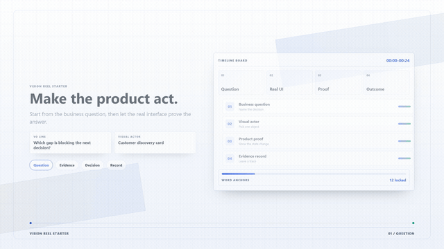
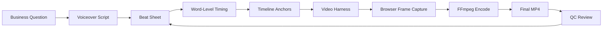
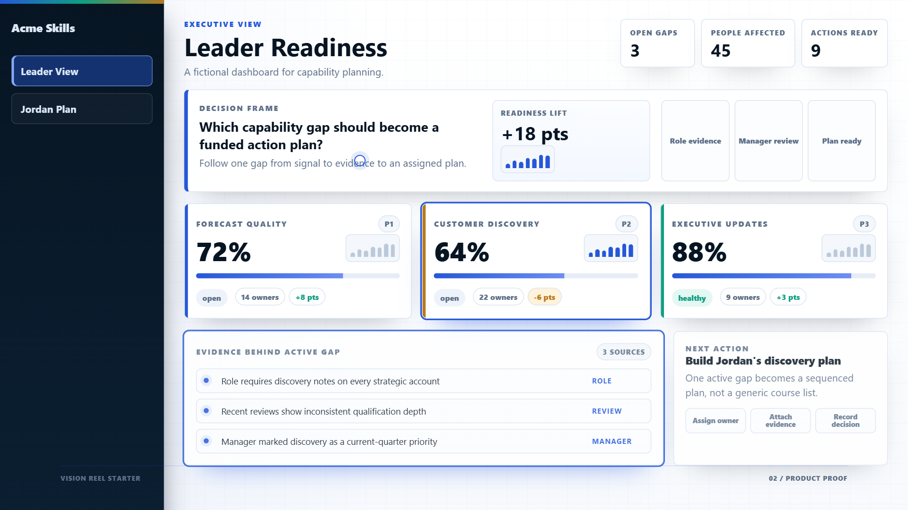

# Vision Reel Playbook

[](https://github.com/hyperchat99999/vision-reel-playbook/actions/workflows/ci.yml)
[](LICENSE)
[](starter/README.md)
[](docs/09-ip-safety.md)
[](starter/README.md)

**Vision Reel Playbook turns a real product, workflow, strategy, or prototype into a short film where the work itself acts out the story and proves each claim on screen.** It pairs a repeatable method with a working starter kit, so an idea that would normally live in a deck or a screen recording becomes something people watch, follow, and remember.

You write the voiceover first, map each sentence to one thing on screen, and your real interface is captured frame-by-frame, timed to your words, and checked for blank frames, broken timing, or leaked private data. The playbook is yours to read; the starter kit runs locally and renders a real-UI film with no paid services — drive it yourself, hand it to a developer, or use a development assistant to run it with you (see [`AGENTS.md`](AGENTS.md)). A voiceover or generated character footage are optional add-ons that may use paid external services.

> **See it move.** The 24-second sample below was rendered end-to-end by the included starter — real UI, word-synced timing, browser-captured frames, FFmpeg stitch. The render pipeline itself needs **no paid APIs**.



<sub>The GIF above is a silent preview. The [full clean cut (`assets/sample-clean.mp4`)](assets/sample-clean.mp4) plays with a sample voiceover from a generic voice-generation service. Audio is optional; films render fine silent. Regenerate the GIF with `npm run gif`.</sub>

**Not sure what to film yet?** Start with the [Idea-to-Film discovery consultant](prompts/idea-to-film-consultant.md) — paste it into your preferred chat assistant or use it as a planning instruction file. It interviews you into a filled brief, beat sheet, and word-anchor plan. No coding needed.

## Quickstart for Non-Coders

You do not need to write code. Three steps:

1. **Shape the idea.** Open the [discovery consultant](prompts/idea-to-film-consultant.md) in your preferred chat assistant. It interviews you and hands back a filled brief, a beat sheet, and word-anchor suggestions.
2. **Hand it off to build.** Give those three artifacts and [`AGENTS.md`](AGENTS.md) to a developer or development assistant, and ask them to set up the kit and render your film. `AGENTS.md` spells out every command and guardrail.
3. **Review and share.** You get a clean 1080p film with built-in quality checks for blank frames, timing, and private-data leaks. Add a voiceover whenever you are ready.

Want to drive it yourself? The [10-minute path](#try-in-10-minutes) and [`MAKE_YOUR_FIRST_FILM.md`](MAKE_YOUR_FIRST_FILM.md) walk through the commands.

## Create A Standalone Project

Create a clean project with the starter, render scripts, safety checks, and templates included:

```bash
npx create-vision-reel my-film
cd my-film
npm run render:sample
```

Before the npm release is published, run the generator from a repository checkout with `node bin/create-vision-reel.cjs my-film`.

## The Promise

Most professional work is trapped in decks, demos, screenshots, or long explanations. Vision Reel Playbook gives you a repeatable workflow for making a sharper artifact:

- Write the voiceover first.
- Map every sentence to one visible screen actor.
- Make real UI or structured visuals demonstrate the idea.
- Use generated clips only where human context helps.
- Render deterministic frames you can reproduce exactly.
- Run QC so the final film has no blank screens, broken timing, or private-data leaks.

## How It Works

Two loops drive every film: a **creative loop** (question → script → beats → word anchors) and a **render loop** (app state → browser frames → stitch → QC). The finished voiceover's word-level timing is the clock everything else runs on.



The harness is driven through a tiny **render contract** — `window.__filmSetT(t)`, `window.__filmReady`, `window.__filmDuration` — so any stack (React, Vue, Svelte, Canvas, or plain HTML) can be stepped frame-by-frame and inspected at any timestamp. The app-native and hybrid-trilogy variants are diagrammed in [`docs/11-architecture.md`](docs/11-architecture.md).

## Try In 10 Minutes

```bash
npm run setup
npm run check
npm run render:sample
```

The sample render creates:

- `assets/sample-clean.mp4`
- `assets/sample-still.png`
- `assets/sample-contact-sheet.jpg`



For the guided path, start with [`MAKE_YOUR_FIRST_FILM.md`](MAKE_YOUR_FIRST_FILM.md).

## What You Can Make

- Product explainers where the real interface acts out the narration.
- Founder or strategy films that make an abstract idea tangible.
- Guided-workflow demos grounded in real product evidence.
- Hybrid films with generated human context plus real UI proof.
- Board, sales, launch, or internal vision videos that feel polished and specific.

## What Makes This Different

Many tools can create videos from code, screenshots, or prompts. This repo focuses on the production method:

- The work itself is the hero of the film.
- The product or idea proves each claim on screen.
- The final voiceover controls scene timing.
- Word-level anchors drive UI reveals, clicks, counters, scrolls, and streams.
- Quality control is artifact-based: contact sheets, frame grabs, blank-frame checks, link checks, and IP scans.
- Everything public-facing is fictional and safe to share.

## How This Compares

The browser → frames → FFmpeg plumbing here is deliberately boring and swappable. What the repo adds is an opinionated **method and quality bar** for one specific kind of film. Here is where it fits, and where another tool may serve you better:

| If you want… | Reach for | What this playbook adds |
| --- | --- | --- |
| A programmatic video engine (build the video in code) | [Remotion](https://www.remotion.dev/), [Motion Canvas](https://motioncanvas.io/), [Revideo](https://re.video/) | A method that drives your **real app** as the film set, plus editorial rules, timing discipline, and QC on top of the renderer. |
| A clickable product tour or quick screen recording | [Arcade](https://www.arcade.software/), [Supademo](https://supademo.com/), [Storylane](https://www.storylane.io/), [Screen Studio](https://www.screen.studio/) | A scripted, **voiceover-timed cinematic film** where every sentence gets one visual actor. |
| High-volume faceless / AI social clips | tools from lists like [awesome-faceless](https://github.com/sasharun/awesome-faceless) | A premium, on-brand format where the **real work is the hero**. |
| Only the browser-to-video plumbing | [timecut](https://github.com/tungs/timecut), [puppeteer-capture](https://github.com/alexey-pelykh/puppeteer-capture) | The same mechanism wrapped in an end-to-end method: word anchors, visual-completeness rules, blank-frame and timing QC, and an IP-safety gate. |

**Use those instead if** you need an interactive demo, a one-off capture, or high-volume generic content. **Use this if** you want a repeatable standard for polished, specific films where a real product or idea proves each claim on screen.

## Showcase

- [`SHOWCASE.md`](SHOWCASE.md) has fictional use cases.
- [`assets/sample-clean.mp4`](assets/sample-clean.mp4) is the rendered starter demo.
- [`assets/sample-contact-sheet.jpg`](assets/sample-contact-sheet.jpg) is the visual QC sheet.
- [`examples/worked-example/`](examples/worked-example/) shows a complete fictional mini-production.

## Repo Map

```text
docs/
  The playbook: thinking, story, aesthetics, generation, rendering, QC, and IP safety.

starter/
  A fictional React/Vite app, video harness, render scripts, and QC scripts.

templates/
  Fill-in templates for briefs, beat sheets, shot lists, word anchors, prompts, and release checks.

examples/
  Worked examples and before/after fixes.

prompts/
  The Idea-to-Film discovery consultant: a paste-ready prompt that turns a fuzzy idea into a brief, beat sheet, and word anchors.

gallery/
  Public-safe showcase cards and metadata.

site/
  Static GitHub Pages landing page.
```

## Build Your Own Film

1. Read [`MAKE_YOUR_FIRST_FILM.md`](MAKE_YOUR_FIRST_FILM.md).
2. Skim [`docs/11-architecture.md`](docs/11-architecture.md).
3. Fill in [`templates/creative-brief.md`](templates/creative-brief.md).
4. Draft narration in [`templates/beat-sheet.csv`](templates/beat-sheet.csv).
5. Map sentences to visual actors in [`templates/word-anchor-map.csv`](templates/word-anchor-map.csv).
6. Adapt the starter app in [`starter/app`](starter/app).
7. Render frames, inspect the contact sheet, then render the final MP4.

## Starter App

The starter app includes:

- A fictional dashboard.
- A learner/workflow screen.
- A `video.html` entry that exposes `window.__filmSetT(t)`.
- A 3-beat timeline: intro, real UI proof, outcome.
- A renderer that starts the app, captures browser frames, and stitches a sample video.

Run the full sample from the repo root:

```bash
npm run setup
npm run render:sample
npm run qc:blank
```

To inspect the starter manually:

```bash
npm run dev
```

Open:

```text
http://localhost:5173/video.html?render=1
```

## IP Safety

Before publishing your own film or fork, run:

```bash
npm run check
```

The short version:

- Do not include real client names, logos, people, screenshots, prompts, transcripts, or voice files.
- Do not paste API keys.
- Do not ship generated assets unless you know their license and provenance.
- Scan the repo for brand strings and internal terms.
- Prefer fictional sample data and neutral examples.

## License

MIT. See [`LICENSE`](LICENSE).
