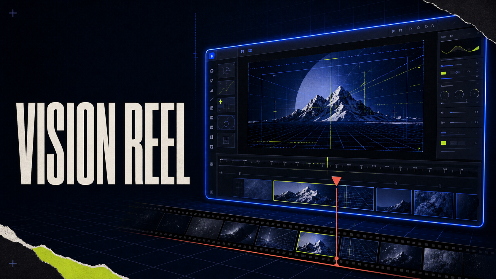
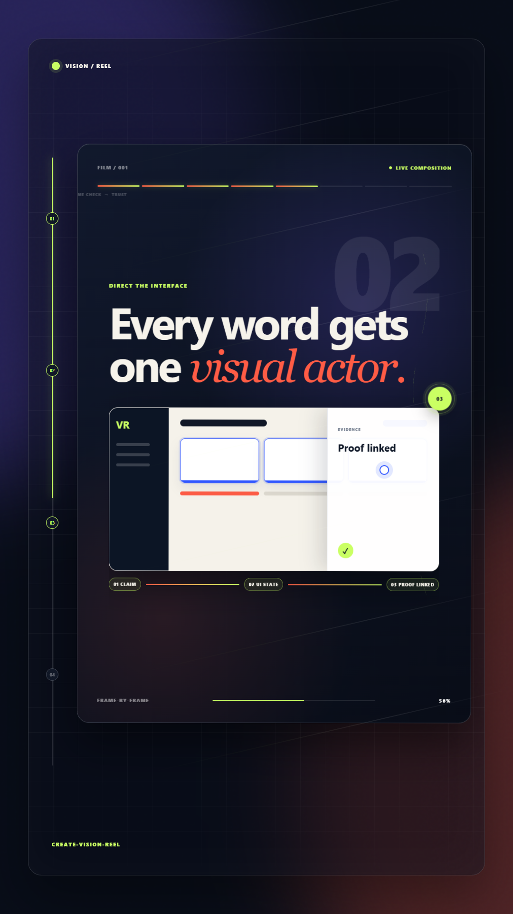
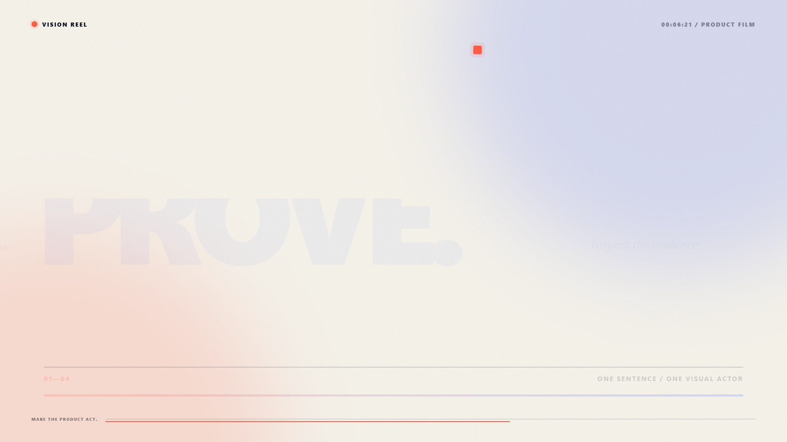
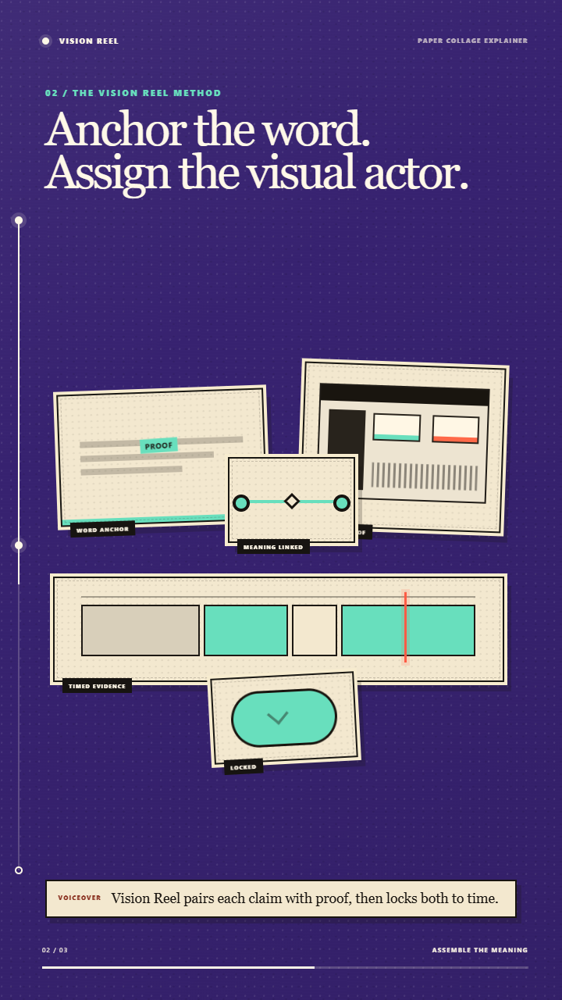
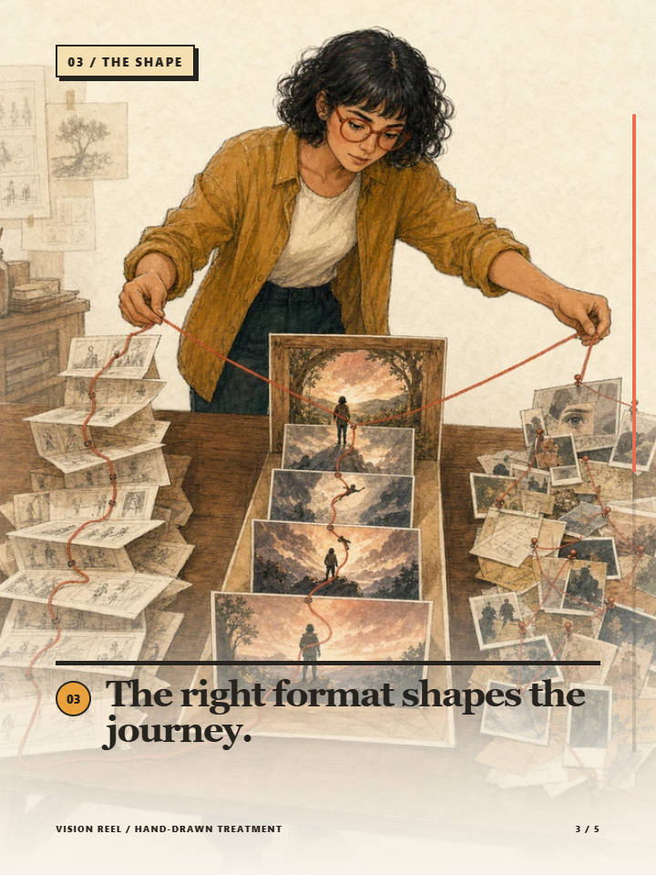
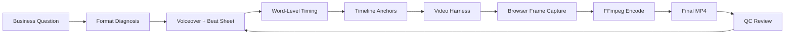

<p align="center">
  <a href="https://vision-reel-playbook-oss.sudiv-gulla-1110.chatgpt.site">
    
  </a>
</p>

<h1 align="center">Vision Reel Playbook</h1>

<p align="center"><strong>Don't record the product. Direct it.</strong></p>

<p align="center">
  An open-source system for turning products, workflows, launches, and ideas into<br />
  polished short films where every claim earns visible proof.
</p>

<p align="center">
  <a href="https://vision-reel-playbook-oss.sudiv-gulla-1110.chatgpt.site"><strong>Watch the showcase</strong></a>
  · <a href="prompts/idea-to-film-consultant.md">Find your format</a>
  · <a href="MAKE_YOUR_FIRST_FILM.md">Make your first film</a>
  · <a href="docs/README.md">Read the playbook</a>
</p>

<p align="center">
  <a href="https://github.com/hyperchat99999/vision-reel-playbook/actions/workflows/ci.yml"></a>
  <a href="https://www.npmjs.com/package/create-vision-reel"></a>
  <a href="LICENSE"></a>
  <a href="docs/19-no-cost-video-generation.md"></a>
  <a href="docs/09-ip-safety.md"></a>
</p>

---

## Three stories. One render system.

Start with the audience's communication problem—not a fashionable visual style.

| 01 · CINEMATIC SCROLL | 02 · EDITORIAL LAUNCH | 03 · VOX COLLAGE |
| :--- | :--- | :--- |
| [](assets/scroll-story-demo.mp4) | [](assets/launch-film-demo.mp4) | [](assets/vox-collage-demo.mp4) |
| **Make a connected journey feel inevitable.** Portrait depth, chapter reveals, and one continuous visual argument. | **Make people care that this now exists.** Landscape kinetic type, campaign energy, and one decisive proof beat. | **Make an abstract mechanism concrete.** Paper actors, meaning-led color, and evidence assembled into a visible payoff. |
| [`Watch 18s film`](assets/scroll-story-demo.mp4) · `9:16` | [`Watch 12s film`](assets/launch-film-demo.mp4) · `16:9` | [`Watch 15s film`](assets/vox-collage-demo.mp4) · `9:16` |

All three formats are deterministic, configurable, reduced-motion aware, and rendered frame by frame. React and CSS draw the scenes; the browser captures exact frames; repository code can synthesize original fallback music; FFmpeg finishes the MP4. The default route needs **no paid generation API**. The showcase masters use a sharper, video-aware ElevenLabs Music v2 suite; that optional production pass is source-documented.

> [!TIP]
> **A fuzzy idea is enough.** Run the [Idea-to-Film discovery consultant](prompts/idea-to-film-consultant.md). It recommends scroll, launch, or collage, explains why the runner-up lost, and produces a buildable brief, beat sheet, evidence treatment, and word-anchor plan—in plain language.

## From idea to finished film

| 1 · DISCOVER | 2 · DIRECT | 3 · PROVE |
| :--- | :--- | :--- |
| Start with the audience's question and choose the format that solves it. | Give every spoken sentence one visible actor: UI, type, spatial chapter, or collage object. | Render reproducibly, inspect contact sheets, check timing, and scan for private data. |
| [Run the consultant →](prompts/idea-to-film-consultant.md) | [Open the creative brief →](templates/creative-brief.md) | [See the quality rubric →](docs/13-quality-rubric.md) |

### For non-technical creators

You do not need to write code. Run the consultant, then give its output and [`AGENTS.md`](AGENTS.md) to a developer or development assistant. You receive a clean format-native MP4 with the quality checks already wired in.

### For builders

Create a self-contained project with the starter, render scripts, safety checks, and templates included:

```bash
npx create-vision-reel@latest my-film --type scroll-story
cd my-film
npm run render:scroll-story
```

Swap `scroll-story` for `launch-film` or `vox-collage`. The original `classic` preset remains available for backward compatibility. Finished public masters are collected in [`videos/`](videos/).

<details>
<summary><strong>Add the optional hand-drawn story treatment</strong></summary>
<br />

[](assets/handdraw-story-demo.mp4)

The [20-second hand-drawn demo](assets/handdraw-story-demo.mp4) turns scattered creator inputs into a causal, human story. It is a treatment—not a fourth communication format—so use its aligned ink-and-color reveal inside a scroll, launch, or collage idea when warmth and cause-and-effect matter. Five original illustrated masters supply the human storytelling; their perfectly registered ink layers are derived locally; the bundled film still costs nothing to render. [Read the treatment guide →](docs/20-handdraw-story-treatment.md)

```bash
npx create-vision-reel@latest my-film --type handdraw-story
npm run render:handdraw-story
```

</details>

<details>
<summary><strong>See the optional generated-media production pass</strong></summary>
<br />

[](assets/vox-collage-higgsfield-demo.mp4)

The [15-second VOX studio cut](assets/vox-collage-higgsfield-demo.mp4) enriches the same deterministic story contract with source-provenanced collage plates, connected Seedance motion, upbeat ElevenLabs narration, and a fast score. The shipped `vox-collage` preset remains the reproducible, paid-service-free implementation.

</details>

## The Promise

Most professional work is trapped in decks, demos, screenshots, or long explanations. Vision Reel Playbook gives you a repeatable workflow for making a sharper artifact:

- Write the voiceover first.
- Map every sentence to one visible actor.
- Let interface evidence, kinetic type, spatial chapters, or collage objects demonstrate the idea.
- Use generated clips only where human context helps.
- Render deterministic frames you can reproduce exactly.
- Run QC so the final film has no blank screens, broken timing, or private-data leaks.

## How It Works

Two loops drive every film: a **creative loop** (question → format → script → beats → word anchors) and a **render loop** (scene state → browser frames → stitch → QC). The finished voiceover's word-level timing is the clock everything else runs on.



The harness is driven through a tiny **render contract** — `window.__filmSetT(t)`, `window.__filmReady`, `window.__filmDuration` — so any stack (React, Vue, Svelte, Canvas, or plain HTML) can be stepped frame by frame and inspected at any timestamp. The shared preset architecture is documented in [`docs/11-architecture.md`](docs/11-architecture.md).

## Try In 10 Minutes

```bash
npm run setup
npm run check
npm run render:scroll-story
```

The signature render creates:

- `assets/scroll-story-demo.mp4`
- `assets/scroll-story-demo-still.png`
- `assets/scroll-story-demo-contact-sheet.jpg`

Render the signature films with:

```bash
npm run render:scroll-story
npm run render:launch-film
npm run render:vox-collage
npm run render:handdraw-story
```

For the guided path, start with [`MAKE_YOUR_FIRST_FILM.md`](MAKE_YOUR_FIRST_FILM.md).

<details>
<summary><strong>See the backward-compatible classic render</strong></summary>
<br />

Run `npm run render:sample` to exercise the original 24-second real-UI proof loop.

[](assets/sample-clean.mp4)

</details>

## What You Can Make

| SELL THE SHIFT | EXPLAIN THE MECHANISM | PROVE THE WORKFLOW |
| :--- | :--- | :--- |
| Product and feature launches, founder stories, keynote openers, repository releases. | Strategy films, concept explainers, creator education, before/after narratives. | Product explainers, guided demos, sales proof, board and internal decision films. |
| **Best starting point:** launch film | **Best starting point:** VOX collage | **Best starting point:** scroll story or real-UI proof inside any format |

## What Makes This Different

Many tools can create videos from code, screenshots, or prompts. This repo focuses on the production method:

- The work itself is the hero of the film.
- The product or idea proves each claim on screen.
- The final voiceover controls scene timing.
- Word-level anchors drive UI reveals, clicks, counters, scrolls, and streams.
- Quality control is artifact-based: contact sheets, frame grabs, blank-frame checks, link checks, and IP scans.
- Everything public-facing is fictional and safe to share.

## How This Compares

<details>
<summary><strong>See where Vision Reel fits among video and demo tools</strong></summary>
<br />

The browser → frames → FFmpeg plumbing here is deliberately boring and swappable. What the repo adds is an opinionated **method and quality bar** for one specific kind of film. Here is where it fits, and where another tool may serve you better:

| If you want… | Reach for | What this playbook adds |
| --- | --- | --- |
| A programmatic video engine (build the video in code) | [Remotion](https://www.remotion.dev/), [Motion Canvas](https://motioncanvas.io/), [Revideo](https://re.video/) | A method that drives your **real app** as the film set, plus editorial rules, timing discipline, and QC on top of the renderer. |
| A clickable product tour or quick screen recording | [Arcade](https://www.arcade.software/), [Supademo](https://supademo.com/), [Storylane](https://www.storylane.io/), [Screen Studio](https://www.screen.studio/) | A scripted, **voiceover-timed cinematic film** where every sentence gets one visual actor. |
| High-volume faceless / AI social clips | tools from lists like [awesome-faceless](https://github.com/sasharun/awesome-faceless) | A premium, on-brand format where the **real work is the hero**. |
| Only the browser-to-video plumbing | [timecut](https://github.com/tungs/timecut), [puppeteer-capture](https://github.com/alexey-pelykh/puppeteer-capture) | The same mechanism wrapped in an end-to-end method: word anchors, visual-completeness rules, blank-frame and timing QC, and an IP-safety gate. |

**Use those instead if** you need an interactive demo, a one-off capture, or high-volume generic content. **Use this if** you want a repeatable standard for polished, specific films where a real product or idea proves each claim on screen.

</details>

## Showcase

- [`SHOWCASE.md`](SHOWCASE.md) has fictional use cases.
- [`assets/sample-clean.mp4`](assets/sample-clean.mp4) is the rendered starter demo.
- [`assets/sample-contact-sheet.jpg`](assets/sample-contact-sheet.jpg) is the visual QC sheet.
- [`examples/worked-example/`](examples/worked-example/) shows a complete fictional mini-production.

Made something with the playbook? Use the [showcase submission form](https://github.com/hyperchat99999/vision-reel-playbook/issues/new?template=showcase_submission.yml) to share a public-safe result.

## Community And Maintenance

- Read the [roadmap](ROADMAP.md) and [open issues](https://github.com/hyperchat99999/vision-reel-playbook/issues) before proposing work.
- Use [GitHub Discussions](https://github.com/hyperchat99999/vision-reel-playbook/discussions) for questions and production ideas.
- Follow [CONTRIBUTING.md](CONTRIBUTING.md) for local checks and public-safety rules.
- See [SUPPORT.md](SUPPORT.md) for help and [SECURITY.md](SECURITY.md) for sensitive reports.

## Repo Map

<details>
<summary><strong>Explore the repository structure</strong></summary>
<br />

```text
docs/
  The playbook: thinking, story, aesthetics, generation, rendering, QC, and IP safety.

starter/
  A fictional React/Vite app, video harness, render scripts, and QC scripts.

templates/
  Fill-in templates for briefs, beat sheets, shot lists, word anchors, prompts, and release checks.

examples/
  Worked examples and before/after fixes.

prompts/
  The Idea-to-Film discovery consultant: diagnoses the communication job, recommends one of three formats, and creates a buildable plan.

gallery/
  Public-safe showcase cards and metadata.

design-references/
  Generated art-direction references and their provenance notes; not runtime assets.

site/
  Lightweight static landing page retained for GitHub Pages compatibility.

website/
  The production Sites showcase with playable masters and the no-cost workflow.
```

</details>

## Build Your Own Film

1. Read [`MAKE_YOUR_FIRST_FILM.md`](MAKE_YOUR_FIRST_FILM.md).
2. Skim [`docs/11-architecture.md`](docs/11-architecture.md).
3. Fill in [`templates/creative-brief.md`](templates/creative-brief.md).
4. Draft narration in [`templates/beat-sheet.csv`](templates/beat-sheet.csv).
5. Map sentences to visual actors in [`templates/word-anchor-map.csv`](templates/word-anchor-map.csv).
6. Adapt the starter app in [`starter/app`](starter/app).
7. Render frames, inspect the contact sheet, then render the final MP4.

## Starter App

The starter app includes:

- A fictional dashboard.
- A learner/workflow screen.
- Three signature presets—cinematic scroll story, editorial launch film, and VOX collage explainer—plus the backward-compatible classic demo.
- A `video.html` entry that exposes `window.__filmSetT(t)`.
- Deterministic enter, hold, and exit choreography for every signature scene.
- A renderer that starts the app, captures browser frames, and stitches a sample video.

Run the full sample from the repo root:

```bash
npm run setup
npm run render:sample
npm run qc:blank
```

To inspect the starter manually:

```bash
npm run dev
```

Open:

```text
http://localhost:5173/video.html?render=1
http://localhost:5173/video.html?preset=scroll-story
http://localhost:5173/video.html?preset=launch-film
```

## IP Safety

Before publishing your own film or fork, run:

```bash
npm run check
```

The short version:

- Do not include real client names, logos, people, screenshots, prompts, transcripts, or voice files.
- Do not paste API keys.
- Do not ship generated assets unless you know their license and provenance.
- Scan the repo for brand strings and internal terms.
- Prefer fictional sample data and neutral examples.

## License

MIT. See [`LICENSE`](LICENSE).

See [`ACKNOWLEDGEMENTS.md`](ACKNOWLEDGEMENTS.md) for design-research attribution.
