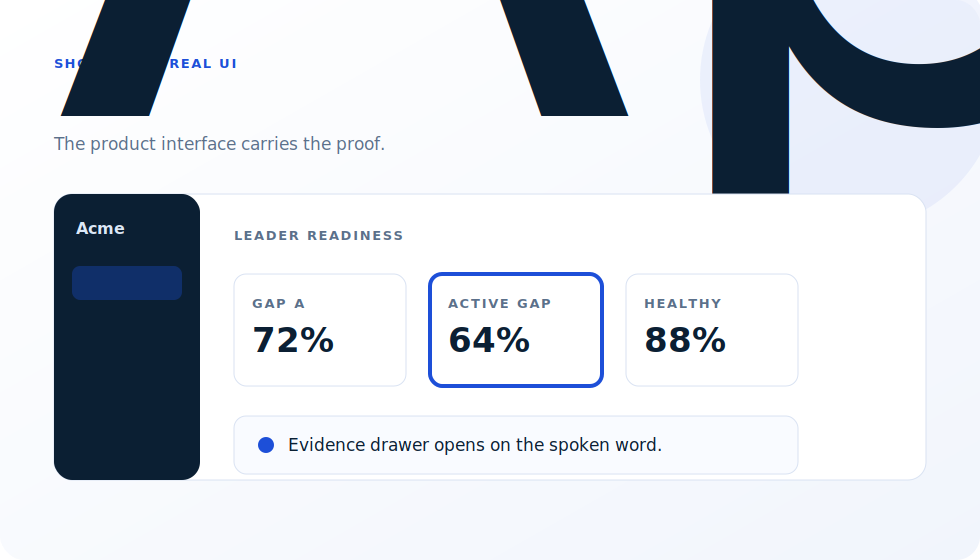
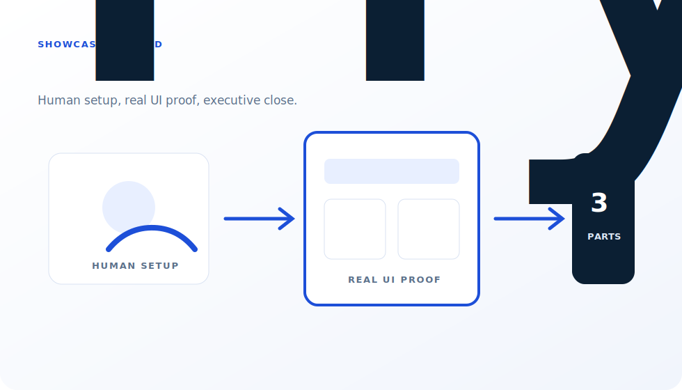
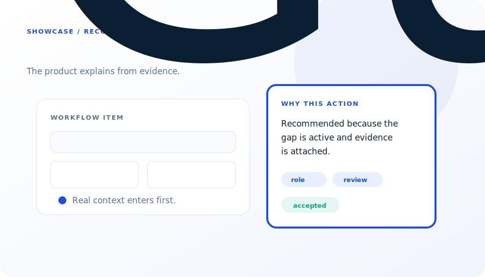

# Showcase

These are fictional examples that demonstrate the playbook patterns. They are not client work, and they do not include private screenshots, prompts, names, or data.

## Rendered Starter Sample

- Video: [`assets/sample-clean.mp4`](assets/sample-clean.mp4)
- Contact sheet: [`assets/sample-contact-sheet.jpg`](assets/sample-contact-sheet.jpg)
- Pattern: voiceover-first structure, deterministic UI states, browser frame capture, FFmpeg stitch.

## Signature Demo: Cinematic Scroll Story

- Video: [`assets/scroll-story-demo.mp4`](assets/scroll-story-demo.mp4)
- Contact sheet: [`assets/scroll-story-demo-contact-sheet.jpg`](assets/scroll-story-demo-contact-sheet.jpg)
- Format: 18 seconds, portrait 9:16, beat-synced 2.5D chapters, connected proof actions, impact transitions, and scroll-led reveals.
- Audio: original 120 BPM procedural score generated locally and embedded in the MP4.
- Cost: no paid video, image, or audio generation service.
- QA and provenance: [`design-references/scroll-story/energy-pass-qa.md`](design-references/scroll-story/energy-pass-qa.md).
- Render: `npm run render:scroll-story`

## Signature Demo: Editorial Launch Film

- Video: [`assets/launch-film-demo.mp4`](assets/launch-film-demo.mp4)
- Contact sheet: [`assets/launch-film-demo-contact-sheet.jpg`](assets/launch-film-demo-contact-sheet.jpg)
- Format: 12 seconds, landscape 16:9, kinetic type, visual contrast, and a product-proof finish.
- Render: `npm run render:launch-film`

## Signature Demo: VOX Collage Explainer

- Video: [`assets/vox-collage-demo.mp4`](assets/vox-collage-demo.mp4)
- Contact sheet: [`assets/vox-collage-demo-contact-sheet.jpg`](assets/vox-collage-demo-contact-sheet.jpg)
- Format: 15 seconds, portrait 9:16, creator problem/solution story with connected paper actors and deterministic secondary actions.
- Audio: original procedural music generated locally and embedded in the MP4.
- Cost: no paid video, image, or audio generation service.
- Render: `npm run render:vox-collage`
- Customize: `starter/app/src/video/vox-collage-config.json`

## Production Pass: VOX Collage Studio Cut

- Video: [`assets/vox-collage-higgsfield-demo.mp4`](assets/vox-collage-higgsfield-demo.mp4)
- Contact sheet: [`assets/vox-collage-higgsfield-demo-contact-sheet.jpg`](assets/vox-collage-higgsfield-demo-contact-sheet.jpg)
- Format: 15 seconds, vertical 480p, three connected five-second paper-assembly clips.
- Visual generation: Nano Banana 2 Lite (`HIGH`) stills and Seedance 2 Mini 480p motion, capped at 18 total Higgsfield credits used.
- Audio: upbeat ElevenLabs voice design plus an instrumental Music v2 score with five- and ten-second transition lifts.
- Provenance and QA: `design-references/vox-collage/`.
- Relationship to the preset: this is the optional production pass; `npm run render:vox-collage` remains the deterministic, paid-service-free reference implementation.

## 1. App-Native Explainer

**Use when:** the product logic is the story.

**Fictional setup:** Acme Skills Platform helps a leader find one capability gap and trace it into a focused employee plan.

**Film structure:**

1. Ask the business question.
2. Show the readiness dashboard.
3. Activate one gap card.
4. Open the evidence rail.
5. Build the employee plan.
6. Close with a proof record.

**Why it works:** the interface does not sit still. Every sentence has a product actor.

## 2. Hybrid Trilogy

**Use when:** the product needs a human setup and a broader narrative arc.

**Fictional setup:** Acme Workflows explains a three-part loop: plan, act, prove.

**Film structure:**

1. Part 1: a manager frames the planning problem.
2. Part 2: the product captures progress and evidence.
3. Part 3: leaders review the proof and decisions.

**Why it works:** generated or filmed people create context, while real UI carries the proof.

## 3. Guided Recommendation Proof Film

**Use when:** the product recommends, drafts, reviews, or explains.

**Fictional setup:** Acme Workbench reviews a workflow item and explains why the next action is recommended.

**Film structure:**

1. Show the real product context.
2. Invoke the recommendation panel.
3. Stream one concise answer.
4. Show evidence chips.
5. Accept or edit the recommendation.
6. Record the outcome.

**Why it works:** the recommendation is grounded in product evidence, not shown as a generic chat demo.

## Showcase Rules

- Every example must use fictional entities.
- Every visual must be public-safe.
- Every example must include a business question, a primary actor, and a proof point.
- Generated media is allowed only when it supports the product story.
