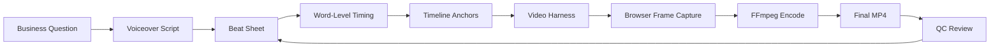
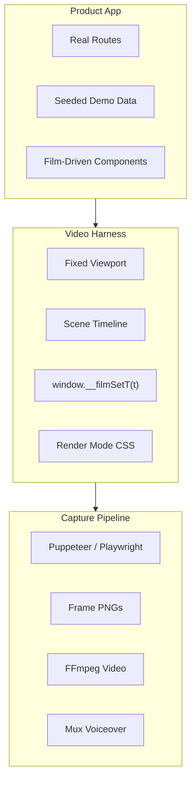
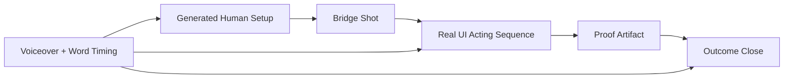

# Architecture

The workflow has two loops:

- Creative loop: question, script, beat sheet, visual actors.
- Render loop: app state, browser frames, stitching, QC.

## End-To-End Flow



## App-Native Film Architecture



## Hybrid Film Architecture



## The Render Contract

Every video page should expose:

```js
window.__filmReady = true;
window.__filmDuration = 24;
window.__filmSetT = (t) => {
  // Set the frame to global second t
};
```

This makes the film inspectable. A reviewer can jump to any timestamp and see the exact frame.

## Preset Architecture

The starter keeps format metadata separate from scene implementation:

```text
preset-manifest.json  dimensions, duration, label, and output contract
default-preset.json   CLI-selected project default
presets.js            resolver shared by preview and render mode
VideoApp.jsx          render globals, preview controls, and preset routing
*Film.jsx             format-specific scene composition
motion.js             deterministic enter / hold / exit helpers
```

The URL can select a preset with `?preset=scroll-story`, `?preset=launch-film`, `?preset=vox-collage`, or the optional `?preset=handdraw-story` treatment. In a generated project, the CLI writes the chosen value to `default-preset.json`; omitting `--type` still selects `classic`.

All presets use the same browser globals, so adding a format does not require a new renderer. The manifest is the authoritative source for duration and default viewport dimensions.

## Timing Data Shape

Keep timing portable and simple:

```json
{
  "beat": "b02",
  "duration": 12.4,
  "anchors": [
    { "time": 1.2, "word": "gap", "actor": "gap-card", "action": "hot-ring" },
    { "time": 4.8, "word": "explains", "actor": "drawer", "action": "open" }
  ]
}
```

The implementation can be React, Vue, Svelte, Canvas, SVG, or plain HTML. The contract matters more than the framework.

