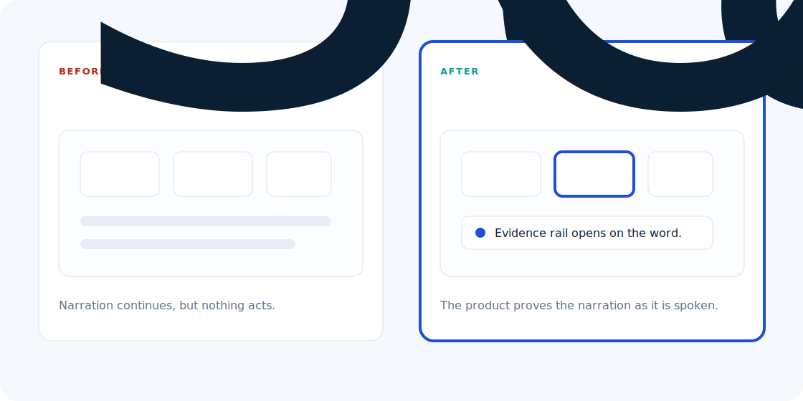

# Before / After Fixes

These examples show common product-film problems and the stronger pattern to use instead.



## 1. Static Dashboard

Before:

```text
Narration: "The leader can see which teams need attention."
Visual: A dense dashboard sits unchanged for 8 seconds.
```

After:

```text
Narration: "The leader can see which teams need attention."
Visual: Team rows ghost in, one risk row gets a hot ring, the risk count lands, and an evidence drawer opens.
```

Why it works:

The viewer knows where to look and sees the claim proven.

## 2. Blank Scroll

Before:

```text
Narration: "The plan resolves conflicts before publishing."
Visual: The page scrolls too far and shows mostly empty background.
```

After:

```text
Narration: "The plan resolves conflicts before publishing."
Visual: The camera rests on a populated guardrails panel. Conflict, capacity, and approval chips resolve in sequence.
```

Why it works:

The sentence gets a purpose-built actor, and the frame stays full.

## 3. Decorative Spotlight

Before:

```text
Visual: A large overlay rectangle highlights roughly the right region.
Problem: It drifts, covers UI, and feels like a presentation annotation.
```

After:

```text
Visual: The component itself dims non-acting panels and gives the active card a native hot ring.
```

Why it works:

The emphasis belongs to the product UI, not an external annotation layer.

## 4. Overlong AI Chat

Before:

```text
Visual: A chat panel streams a paragraph for 12 seconds.
Problem: Viewers stop reading and miss the product proof.
```

After:

```text
Visual: The first sentence streams with a caret. Supporting evidence chips appear pre-written. The accepted action lands in the workflow.
```

Why it works:

The assistant feels alive without turning the film into a reading task.

## 5. Generic AI Character Clip

Before:

```text
Visual: A businessperson speaks in a generic office for 20 seconds.
Problem: It looks polished but does not connect to the product.
```

After:

```text
Visual: A 5-second setup line, then a bridge to the real product UI where the claim is proven.
```

Why it works:

The human moment creates context; the product carries the proof.

## 6. Too Many Accents

Before:

```text
Visual: Purple highlights, blue buttons, green rings, amber cards, and red icons all compete.
```

After:

```text
Visual: One accent for attention. Semantic colors only for status: confirmed, warning, critical.
```

Why it works:

Color becomes language instead of decoration.
